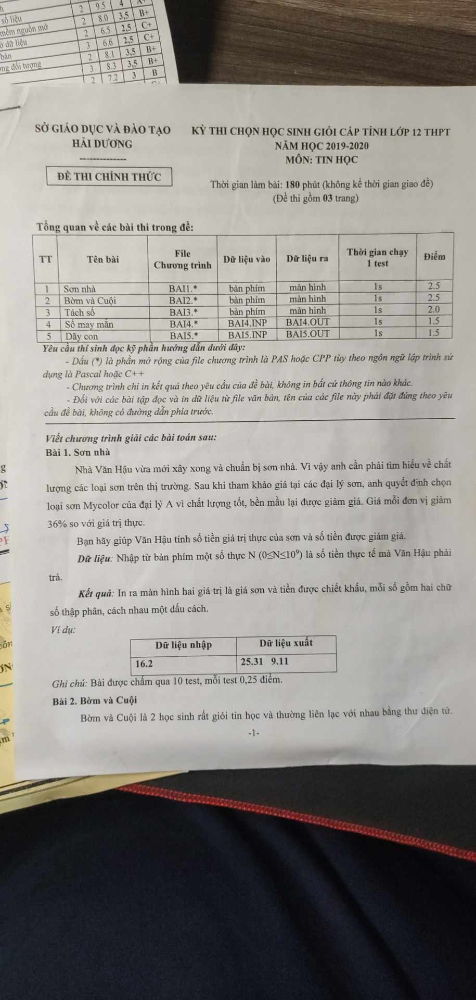
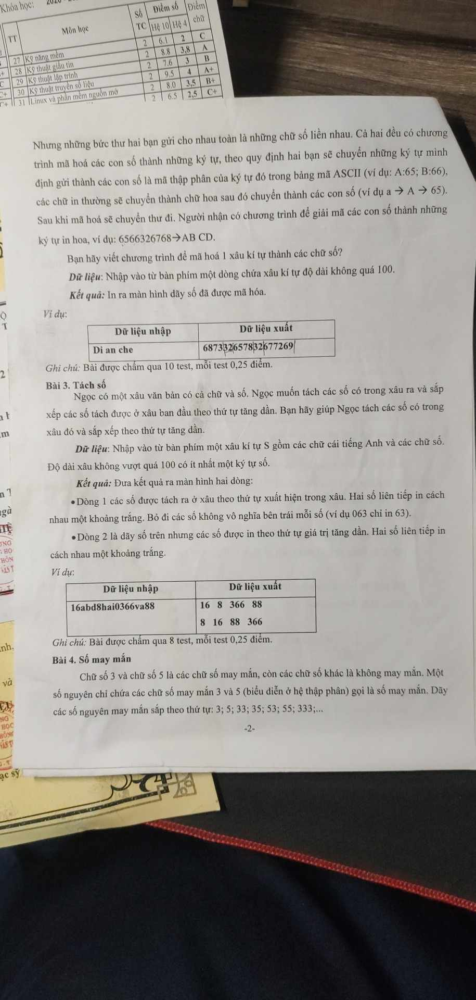
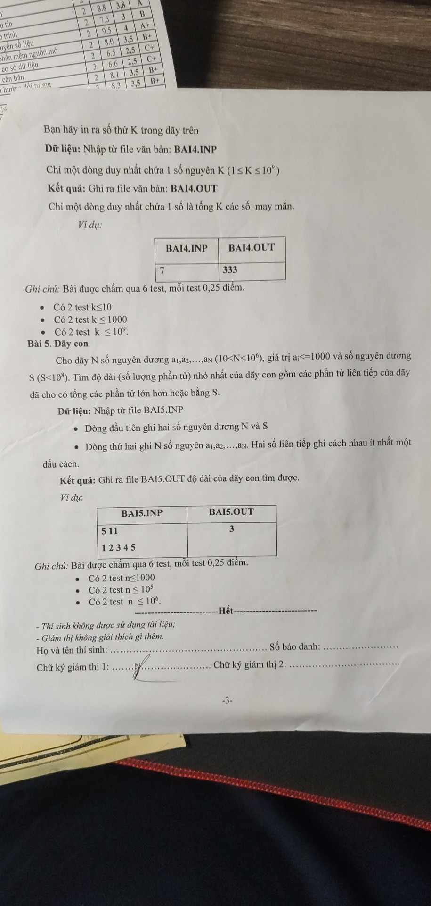

# Đề HSG Tỉnh 12 (2019-2020)

## [1.Sơn nhà](./son_nha/BAI1.cpp)

## [2.Bờm và cuội](./bom_va_cuoi/BAI2.cpp)

## [3.Tách số](./tach_so/BAI3.cpp)

## [4.Số may mắn](./somayman/BAI4.cpp)

[Tính lũy thừa bằng công thức truy hồi](https://freetuts.net/thuat-toan-tinh-luy-thua-nhanh-trong-cc++-2681.html)

## [5.Dãy con](./day_con/BAI5.cpp)

[ Kĩ thuật Sliding Window](https://www.geeksforgeeks.org/window-sliding-technique/)