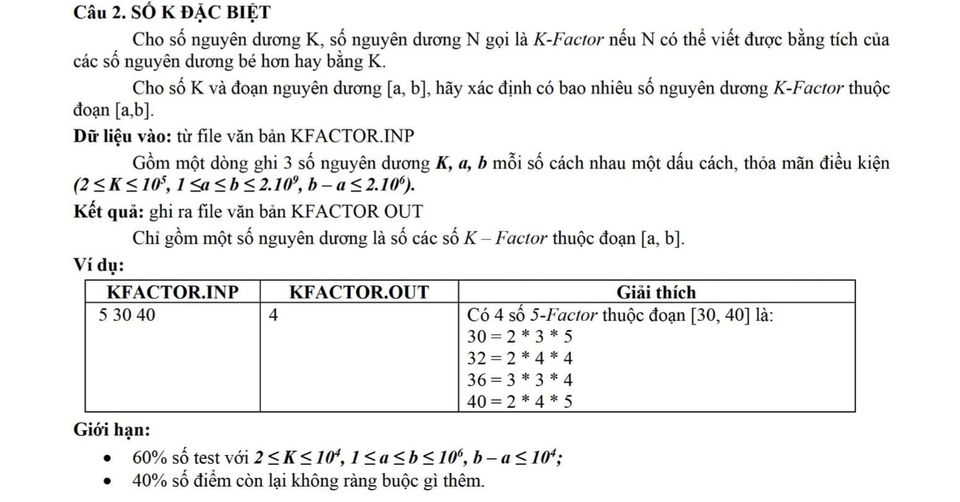

### Special_K

#### Thuật toán sử dụng:

- [Sàng số nguyên tố Eratosthenes](https://blog.28tech.com.vn/sang-so-nguyen-to)

Do bài này giới hạn khá lớn nên mình dùng thuật toán cải tiến của Eratosthenes là sử dụng Bitset(Cải tiến 3 trong link bên dưới) nên cũng phức tạp hơn.

Ngoài ra còn các thuật toán sàng số nguyên tố khác và mình sẽ để nó ở đây: [Chuyên đề sàng số nguyên tố](https://view.officeapps.live.com/op/view.aspx?src=https%3A%2F%2Fstorage-vnportal.vnpt.vn%2Flci-ubnd-responsive%2Fsitefolders%2Fthptchuyen-laocai%2F5251%2Fchuyen-de%2Fsang-so-nguyen-to.docx&wdOrigin=BROWSELINK)

#### Approach to solve

- Sử dụng thuật toán sàng số nguyên tố từ `0->b`

- Kiểm tra xem `K>a` không. Nếu có thì bỏ qua đoạn đầu bắt đầu từ K luôn

- Chạy vòng lặp for kiểm tra từng số trong khoảng `[a,b]` (dùng theo phương pháp phân tách thành tích các số nguyên tố)

### SOLVE [Special_K](./Special_K.c)
