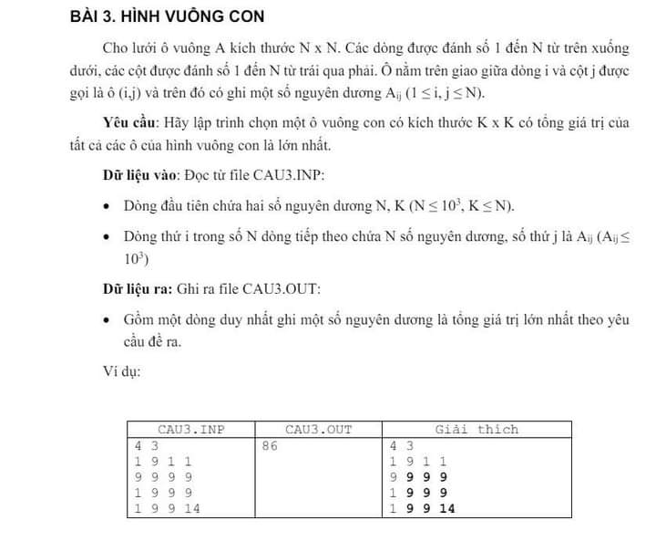

### Small_square

#### Thuật toán sử dụng:

- [Prefix_sum_array](https://www.geeksforgeeks.org/prefix-sum-array-implementation-applications-competitive-programming/?fbclid=IwZXh0bgNhZW0CMTEAAR03PDYZk5ZgRZ5CzjtDGupm94E4uTI-4QL9FUkBNyIF8iTNCZdS7EhGNuU_aem_uvGDvi8tgq7fpeoRQQx_hg)

- [Max sum submatrix](https://www.youtube.com/watch?v=fYwhI-Onp1k): Giúp ta hiểu được cách tính tổng của hình vuông con thông qua `Prefix_sum_array`
#### Approach to solve

##### Tính toán ma trận Prefix Sum :

- Ma trận Prefix Sum được tính sao cho `prefix_sum[i][j]` chứa tổng tất cả các phần tử trong ma trận con từ `(1,1)` đến `(i,j)` của ma trận gốc.

- Công thức tính prefix sum là:

`prefix_sum[i][j]=matrix[i−1][j−1]+prefix_sum[i−1][j]+prefix_sum[i][j−1]−prefix_sum[i−1][j−1]`

##### Tính tổng hình vuông con max:

- Xét tất cả trường hợp các ô vuông con `𝐾×𝐾` hợp lý từ góc trên bên trái trong ma trận.

- Công thức tính tổng của ô vuông con:

`total=prefix_sum[i][j]−prefix_sum[i−K][j]−prefix_sum[i][j−K]+prefix_sum[i−K][j−K]`

- So sánh xem tổng của hình vuông con nào lớn nhất.

#### SOLVE: [Small_square](./Small_square.c)